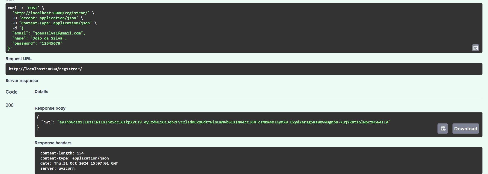
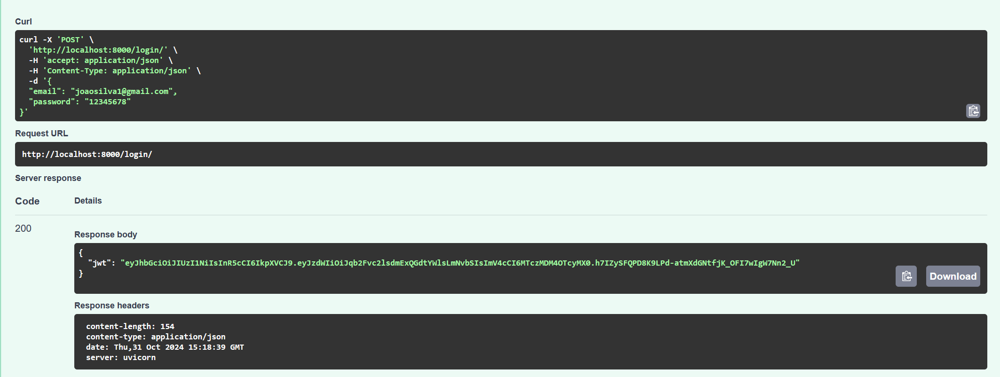
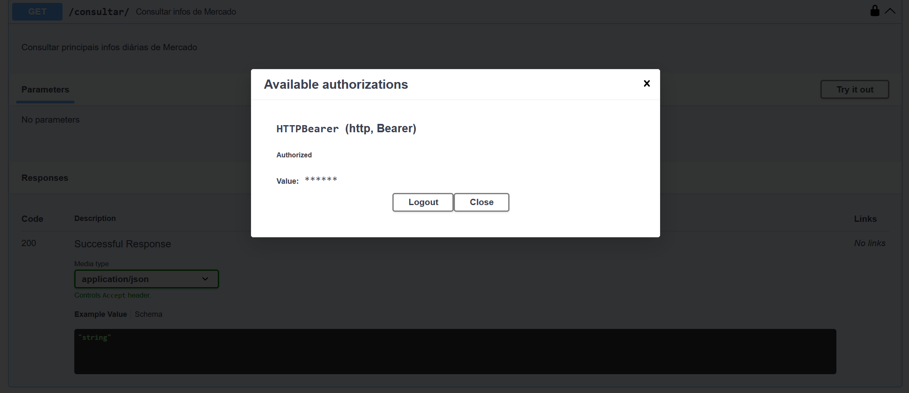
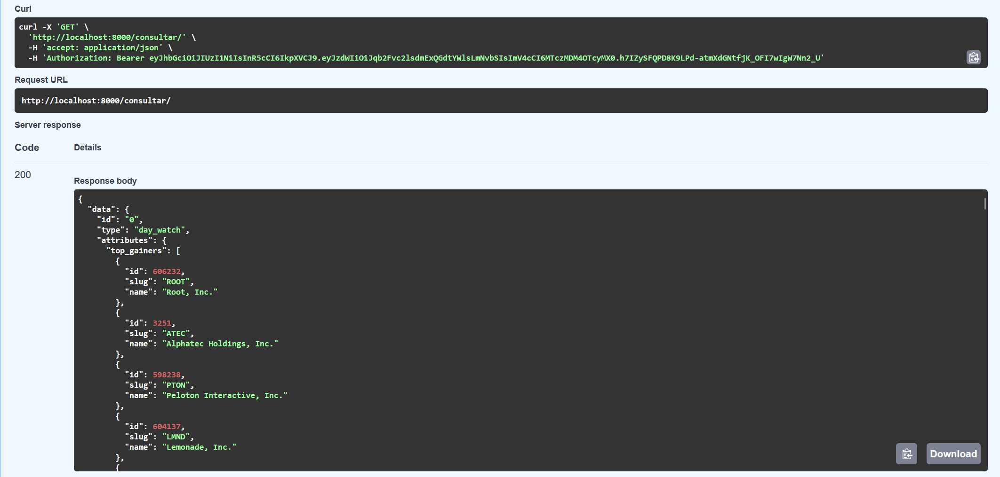

## Como Executar a Aplicação

1. **Pré-requisitos**:
    - Docker e Docker Compose instalados

2. **Passos para execução**:
      - Baixe o arquivo **compose.yaml**:  
        [compose.yaml](https://raw.githubusercontent.com/DavidConselvan/projeto-cloud/refs/heads/main/compose.yaml)  

    - Rode o container:  
        Com o Docker ativo, execute o docker compose  dentro da pasta onde o arquivo compose.yaml foi baixado:

      ```bash
      docker compose up
      ```

    - Acesse o Swagger (FastAPI) para testar os endpoints da API, em:

    ```bash
    http://localhost:8000/docs#
    ```

    - Quando terminar, pare o container usando:  

    ```bash
    docker compose down
    ```

## Documentação dos Endpoints da API

### POST /registrar
- **Descrição**: Registra um novo usuário e retorna seu token de autenticação

- **Exemplo de Body da Requisição**:  
    - Insira os dados necessários no seguinte formato:
  ```json
  {
    "email": "joaosilva@gmail.com",
    "name": "João da Silva",
    "password": "12345678"
  }
  ```
  
- **Exemplo de Resposta**:
  ```json
  {
    "jwt": "token_autenticacao"
  }
  ```

- **Copie e guarde o token gerado!**

- **Teste Registrar:**
  
  <div style="text-align: center;">
    
  </div>


### POST /login
- **Descrição**: Verifica credenciais de usuário e retorna seu token de autenticação

- **Exemplo de Body da Requisição**:  
    - Insira seus dados no seguinte formato:
  ```json
  {
    "email": "joaosilva@gmail.com",
    "password": "12345678"
  }
  ```
  
- **Exemplo de Resposta**:
  ```json
  {
    "jwt": "token_autenticacao"
  }
  ```
  
- **Copie e guarde o token gerado!**

- **Teste Login:**
  
  <div style="text-align: center;">
    
  </div>

> 💡 **Atenção!**
> 
> O token JWT gerado é válido por apenas 30 minutos. Após esse período será necessário logar novamente e gerar outro token.


### GET /consultar
- **Descrição**: Verifica se o usuário está autenticado e então consulta e devolve dados externos que contém as principais informações diárias de mercado 

- **Autenticação**:  Faça a autenticação clicando no cadeado no canto direito do endpoint, depois insira seu token JWT obtido anteriormente e clique em **"Authorize"**

- Uma vez autenticado, execute a requisição

- **Exemplo de Resposta**:
  ```json
  {
    "data": {
      "id": "0",
      "type": "day_watch",
      "attributes": {
        "top_gainers": [
          {
            "id": 606232,
            "slug": "ROOT",
            "name": "Root, Inc."
          },
          {
            "id": 3251,
            "slug": "ATEC",
            "name": "Alphatec Holdings, Inc."
          },
          ...
        ]
      }     
      ...
    }
    ...
  }
  ```

- **Teste Consulta**  
    - *Autenticação*:

    <div style="text-align: center;">
    
  </div>

    - *Resposta*:

    <div style="text-align: center;">
    
  </div> 

###Video de execução da API

<iframe width="100%" height="315" src="https://www.youtube.com/embed/BZPGxcwkEGI" frameborder="0" allow="accelerometer; autoplay; encrypted-media; gyroscope; picture-in-picture" allowfullscreen></iframe>
